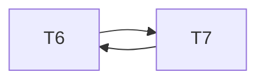

# Ejercicio 5
Para las siguientes transacciones T6 y T7 con A = B = 25:
- a) ¿Cuáles son los resultados posibles con la ejecución en serie de estas transacciones? Justificar.
- b) Armar dos planificaciones no serie serializables en cuanto a conflictos. Justificar.
- c) Armar una planificación no serie NO serializable en cuanto a conflictos.

|      T6      |      T7     |
| :----------: | :---------: |
|    Read(A)   |   Read(A)   |
| A := A + 100 | A := A \* 2 |
|   Write(A)   |   Write(A)  |
|    Read(B)   |   Read(B)   |
| B := B + 100 | B := B \* 2 |
|   Write(B)   |   Write(B)  |

---

## A) Resultados de las ejecuciones en serie

> Los posibles resultados con la ejecucion en serie de estas transacciones son 2!=2, ya que la cantidad de transacciones posibles son n!

Dado A = B = 25, los dos órdenes posibles y sus resultados son:

1. **Orden T₆ → T₇**  
   - Tras ejecutar **T₆**:  
     - A = 25 + 100 = 125  
     - B = 25 + 100 = 125  
   - Tras ejecutar **T₇**:  
     - A = 125 × 2 = 250  
     - B = 125 × 2 = 250  
   **Resultado final:** (A, B) = **(250, 250)**

2. **Orden T₇ → T₆**  
   - Tras ejecutar **T₇**:  
     - A = 25 × 2 = 50  
     - B = 25 × 2 = 50  
   - Tras ejecutar **T₆**:  
     - A = 50 + 100 = 150  
     - B = 50 + 100 = 150  
   **Resultado final:** (A, B) = **(150, 150)**

## B) Planificaciones conflict-serializables (en tablas)

| Planificación | Operaciones en orden                                                                                       | Conflictos y aristas                                              | Grafo equivalente |
|--------------:|:------------------------------------------------------------------------------------------------------------|:------------------------------------------------------------------|:------------------|
| **S₁** (T₆→T₇) | `R6(A), W6(A), R6(B), W6(B), R7(A), W7(A), R7(B), W7(B)`                                                   | **A**: W6(A)→R7(A), W6(A)→W7(A)    **B**: W6(B)→R7(B), W6(B)→W7(B) | T₆ → T₇           |
| **S₂** (T₇→T₆) | `R7(A), W7(A), R7(B), W7(B), R6(A), W6(A), R6(B), W6(B)`                                                   | **A**: W7(A)→R6(A), W7(A)→W6(A)    **B**: W7(B)→R6(B), W7(B)→W6(B) | T₇ → T₆           |

- **Operaciones**: lectura (`R`) y escritura (`W`) de cada transacción sobre A y B.
- **Conflictos**: pares de operaciones sobre la misma variable donde al menos una es escritura, indicando el orden forzado.
- El **grafo** muestra que no hay ciclos, por lo que ambas planificaciones son conflict-serializables.  

## c) Planificación **no** conflict-serializable

Partiendo de A = B = 25, consideremos el siguiente intercalado:

| Paso | Operación  | Variable | Transacción |
|-----:|:-----------|:---------|:------------|
| 1    | `R6(A)`    | A        | T₆          |
| 2    | `W6(A)`    | A        | T₆          |
| 3    | `R7(A)`    | A        | T₇          |
| 4    | `W7(A)`    | A        | T₇          |
| 5    | `R7(B)`    | B        | T₇          |
| 6    | `W7(B)`    | B        | T₇          |
| 7    | `R6(B)`    | B        | T₆          |
| 8    | `W6(B)`    | B        | T₆          |

**Conflictos detectados**  
- **Sobre A**:  
  - `W6(A)` → `R7(A)`  ⇒ arista **T₆ → T₇**  
  - `W6(A)` → `W7(A)`  ⇒ arista **T₆ → T₇**  
- **Sobre B**:  
  - `W7(B)` → `R6(B)`  ⇒ arista **T₇ → T₆**  
  - `W7(B)` → `W6(B)`  ⇒ arista **T₇ → T₆**  

**Grafo de precedencia**  

Hay un ciclo **T₆→T₇→T₆**, por lo que esta planificación **no** es conflict-serializable.  

# Ejercicio 15 (versión definitiva)

## 1. Bitácora (log) – Actualización inmediata

| LSN | Acción                     | Detalles                          |
|-----|----------------------------|-----------------------------------|
|  1  | `<Inicio T1>`               | Inicio de T₁                      |
|  2  | `<T1, T = x * 2`  | write(T) := X * 2                 |
|  3  | `<Inicio T2>`               | Inicio de T₂                      |
|  4  | `<T2, Y = Y + 4`  | write(Y) := Y + 4                 |
|  5  | `<Inicio T3>`               | Inicio de T₃                      |
|  6  | `<T3, Y = X = 10` | write(Y) := X + 10                |
|  7  | `<COMMIT T3>`              | T₃ confirma y sus cambios persisten |
| —   | **CRASH**                  | Antes de que T₂ lea/escriba Z     |

> **Nota:** Aunque T₁ y T₂ nunca hacen COMMIT, sus writes ya fueron aplicados (inmediato).

## 2. Recuperación

1. **REDO** (sólo transacciones confirmadas):  
   - Reaplicar LSN 6: `<T3, Y, …, new′(Y)>` → garantizar Y = X+10 en disco.

2. **UNDO** (todas las transacciones sin COMMIT), en orden inverso:  
   - LSN 4: deshacer `<T2, Y, old(Y), new(Y)>` → restaurar Y = old(Y).  
   - LSN 2: deshacer `<T1, T, old(T), new(T)>` → restaurar T = old(T).

3. **Estado final**:  
   - **Y** conserva el cambio de T₃.  
   - **T** y **Y** (de T₂) vuelven a sus valores anteriores.  
   - **Z** nunca se modificó en disco y permanece intacto.

